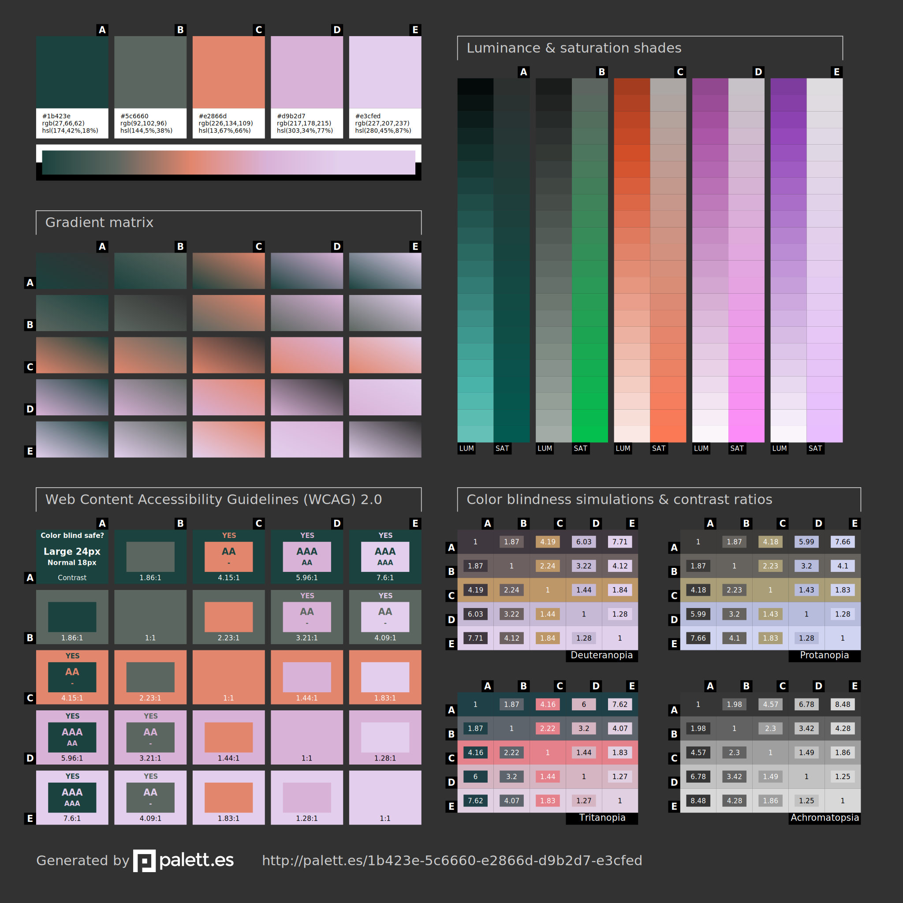

# Romina Font - Portfolio
Bienvenidos a mi portfolio hecho en enero de 2024

# Sobre mi portfolio

Esta web es una web que pretende estar en constante evolución según avancen mis conocimientos en como frontend y visual designer. Este es el primer proyecto web que hago programado enteramente por mi profesionalemente. Por lo que es la carta de visita perfecta para saber cual es mi grado de conocimientos en cuanto a HTML, CSS y JasaScript. 

He decidido aplicar estilos que ahora son tendencia en el mundo del siño digital como el glassmorphism o los degradados animados, todo ello aplicado desde css. 

Aquí tambien se muestran todas mis facetas como creativa: diseñadora gráfica, uxui, fotógrafa e ilustradora. 

## Lenguajes utilizados

- HTML
- CSS
- JavaScript

## Branding 
Branding sencillo que pretende no destacar entre los proyectos que se muestran. 

### Paleta de color:
Mi paleta pasa todos los controles de accesibilidad y la extraje de https://palett.es/ esta web analiza colores y testea que sean funcionales y visibles para todas las personas.
- BG-color: #fcfcfc;
- Titles-color: #112d2a;
- Black-color: #111111;
- White-color: #EEEEEE;
- Highlight-color: #e2866d;

https://palett.es/1b423e-5c6660-e2866d-d9b2d7-e3cfed

### Tipografías (Google Fonts):
-Lato: como fuente principal con 3 variables de peso(400,700,900)
-Instrument italic para efectos y animaciones específicas

## Moodboard
Antes de empreder el camino diseñando, prototipando y desarrollando tuve una sesión de brainstorming e inspiración donde cree este tablero.

### Webs alucinantes que me encantaron:
- https://radilson.com/
- https://www.ivettefelixuy.com/
- https://www.griflan.com/
- https://shelyvaisman.com/
- https://www.iamtamara.design/

## Prototipo primitivo en Excalidraw

https://excalidraw.com/#json=AQlqKmwcqEFCk0K02TV2o,UM7N7jmMPacU13t0AkxxCQ

## Herramientas de organización y gestión del tiempo
- Trello
- Notion

# Páginas del proyecto

## Landing principal
Landing principal con galerías de visualización de proyectos e imagenes. 

## Proyectos
En esta página se muestran tarjetas con previews a mis proyectos, al click te lleva a ver en detalle el proyecto.

## View
Página donde se muestra en detalle cada proyecto.

## Galeria
En esta página muestros fotografías e ilustraciones mediante una galeria responsive que al click en cada foto abre un modal con la imagen en full size.

## About en formato grid 
Cada celda es una información diferente sobre y en el segundo donde se muestra mi fotografía hay un input para saludar.

# Contacto
Si te ha gustado este proyecto no dudes en ponerte en contacto conmigo, ¡me haría muchísima ilusión!
- Mail: romina.create@gmail.com
- Instagram: romina.create
- LinkedIn: Romina Font Regalado